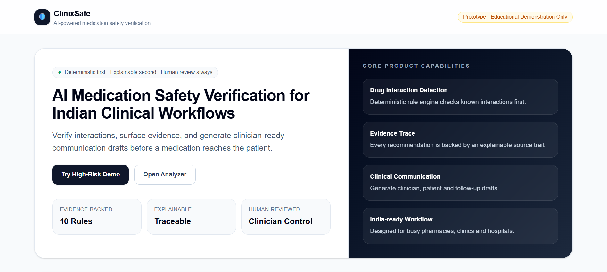
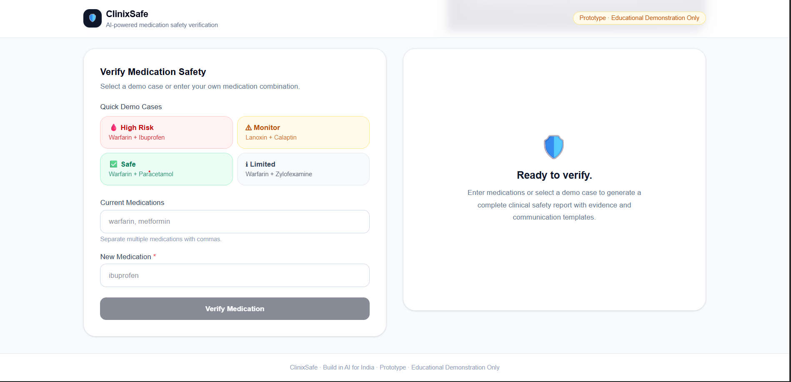
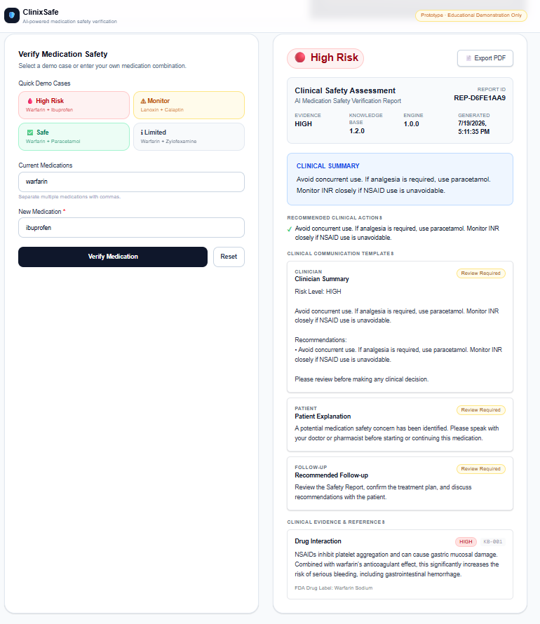
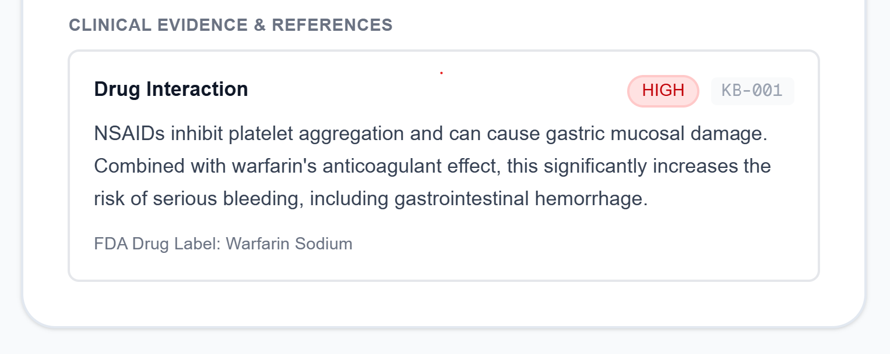
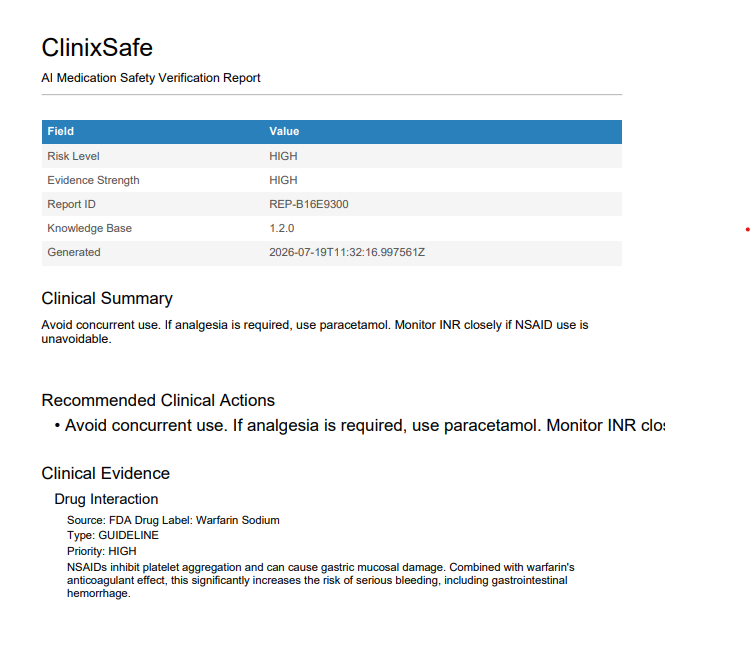

# ClinixSafe 🛡️  
**AI-Powered Medication Safety Verification for Indian Healthcare Workflows**

ClinixSafe is a clinical safety assistant that helps healthcare professionals verify medication combinations, surface evidence, and generate clinician-ready communication drafts. It is designed for Indian pharmacies, clinics, primary health centres, telemedicine workflows, and small hospitals where polypharmacy and high patient volume make medication safety checks critical.

> **Prototype · Not for clinical use**

---


## Live Demo

- **Frontend:** https://clinix-safe.vercel.app
- **Backend API:** https://web-production-3e6b2.up.railway.app
- **GitHub Repository:** https://github.com/25cs249-create/ClinixSafe
---

## What ClinixSafe Does

ClinixSafe accepts one or more current medications and a new medication, then:

1. Normalizes brand names to generic names
2. Checks known drug interactions with a deterministic rule engine
3. Returns a structured safety report
4. Shows evidence trace and clinical recommendations
5. Generates clinician, patient, and follow-up communication drafts
6. Keeps clinician review in control before any communication is sent
7. Exports a downloadable clinical report PDF

---

## Why This Matters for India

Medication errors are especially risky in:

- Indian pharmacies with fast dispensing workflows
- Tier 2 and Tier 3 hospitals
- Primary health centres
- Telemedicine consultations
- Patients managing multiple prescriptions
- Brand-name and generic-name mix-ups in Indian drug markets

ClinixSafe is built to help clinicians verify safety quickly while keeping the final decision with the clinician.

---

## Key Features

### Medication Safety Verification
- Deterministic interaction checking
- Brand-to-generic alias resolution
- Unknown medication handling
- Risk levels:
  - SAFE
  - MONITOR
  - REVIEW
  - HIGH
  - CONTRAINDICATED
  - LIMITED

### Evidence Trace
- Every recommendation is backed by a traceable source trail
- Clinical evidence is shown directly in the UI

### Clinical Communication Drafts
- Clinician summary
- Patient-friendly explanation
- Follow-up guidance
- Human review before sending

### Professional Demo Experience
- Quick demo cases for instant live presentation
- Clinical-grade result screen
- Downloadable PDF clinical report

### India-Focused Design
- Built for polypharmacy scenarios
- Designed around Indian medication names and brand aliases
- Helpful for busy clinical workflows

---

## Architecture

```text
User
  ↓
Next.js Frontend
  ↓
FastAPI Backend
  ↓
Deterministic Rule Engine
  ↓
Knowledge Base + Alias Resolver
  ↓
Safety Report
  ↓
Evidence Trace
  ↓
Communication Drafts
  ↓
PDF Export

## Workflow

```text
Medication Entry
        │
        ▼
Brand Normalization
        │
        ▼
Drug Interaction Analysis
        │
        ▼
Risk Classification
        │
        ▼
Evidence Trace Generation
        │
        ▼
Clinical Recommendations
        │
        ▼
Communication Draft Generation
        │
        ▼
PDF Clinical Report
```

---

# Technology Stack

| Layer | Technology |
|-------|------------|
| Frontend | Next.js 16, React 19, TypeScript |
| Styling | Tailwind CSS |
| Backend | FastAPI |
| Language | Python |
| Rule Engine | Custom Deterministic Clinical Engine |
| Knowledge Base | JSON Clinical Knowledge Base |
| PDF Export | jsPDF + AutoTable |
| API Client | Axios |
| Deployment | Vercel + Railway |
| Version Control | GitHub |

---

# Features

## Medication Safety Verification

- Drug-drug interaction detection
- Risk classification
- Clinical recommendations
- Alternative medications
- Warnings
- Explainable AI outputs

---

## Clinical Evidence

Every recommendation includes

- Evidence source
- Source type
- Clinical priority
- Human-readable explanation

---

## Communication Drafts

Automatically generates

- 👨‍⚕️ Clinician Draft
- 👤 Patient Draft
- 📅 Follow-up Draft

while keeping the clinician in control before any communication is shared.

---

## PDF Export

Generate professional clinical reports including

- Report ID
- Risk Level
- Clinical Summary
- Recommendations
- Evidence
- Communication Drafts
- Timestamp

---

## Quick Demo Cases

One-click demonstrations for judges.

Available demo scenarios:

| Scenario | Expected Result |
|----------|-----------------|
| Warfarin + Ibuprofen | 🔴 High Risk |
| Lanoxin + Calaptin | 🟡 Monitor |
| Warfarin + Paracetamol | 🟢 Safe |
| Warfarin + Zylofexamine | ⚪ Limited Evidence |

---

# API Endpoints

## GET /

Backend status endpoint.

---

## GET /health

Returns application health.

---

## GET /demo/high-risk

Returns a ready-made demonstration report.

---

## POST /api/v1/analyze

Analyzes medication combinations.

Example request

```json
{
  "currentMedications": [
    "warfarin"
  ],
  "newMedication": "ibuprofen"
}
```

---

# Clinical Report Output

ClinixSafe returns

- Risk Level
- Clinical Summary
- Recommendations
- Alternative Medications
- Warnings
- Evidence Trace
- Communication Drafts
- Report Metadata
- Generated Timestamp

---

# Screenshots


## Home



## Demo Cases



## High Risk Analysis



## Evidence Trace



## PDF Export



# Local Development

## Backend

```bash
cd backend
pip install -r requirements.txt
uvicorn main:app --reload
```

---

## Frontend

```bash
cd frontend
npm install
npm run dev
```

---

# Production Build

## Frontend

```bash
cd frontend
npm run build
```

---

## Backend

Railway automatically deploys from GitHub.

---

# Future Roadmap

- Advanced clinical reasoning
- Larger medication knowledge base
- More Indian brand aliases
- Multilingual patient communication
- Voice-assisted medication entry
- FHIR integration
- Electronic Health Record (EHR) integration
- Clinical analytics dashboard
- Mobile application
- Offline-first support

---

# Project Status

| Feature | Status |
|---------|--------|
| Medication Verification | ✅ |
| Drug Interaction Detection | ✅ |
| Clinical Recommendations | ✅ |
| Evidence Trace | ✅ |
| Communication Drafts | ✅ |
| PDF Export | ✅ |
| Quick Demo Cases | ✅ |
| Live Deployment | ✅ |

---

# Built For

**Build in AI for India 🇮🇳**

An AI innovation challenge focused on solving real-world problems using AI and partner technologies.

---

# Disclaimer

ClinixSafe is a prototype developed for demonstration and educational purposes.

It is **not** a certified medical device and should **not** replace professional clinical judgment.

---

# License

MIT License

Copyright (c) 2026 ClinixSafe